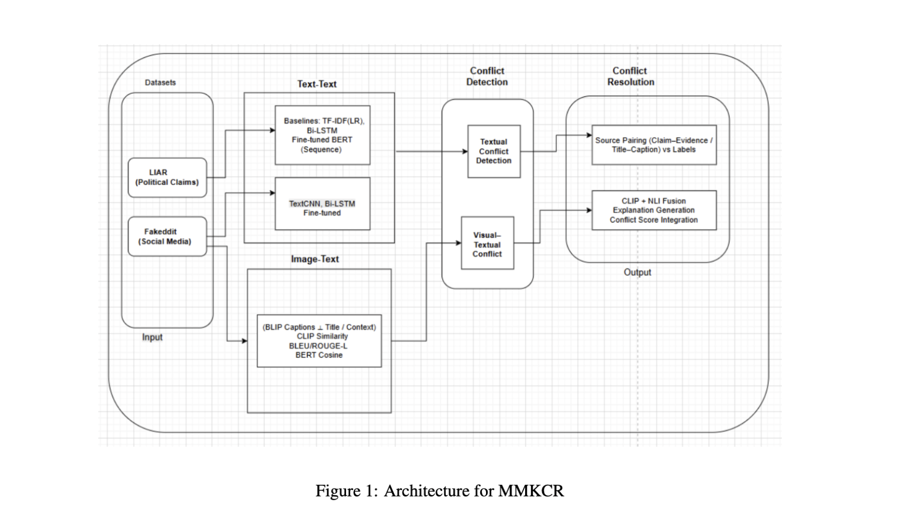

# 🚀 Multi-Modal Knowledge Conflict Resolution (MMKCR)

> Detecting and explaining inconsistencies between **textual claims and visual content** using interpretable multimodal reasoning.

---

## 📌 Overview

The **MMKCR system** is designed to identify and explain semantic conflicts between text and images in real-world data such as social media posts.

Unlike traditional multimodal models:
- ❌ Collapse modalities into a single representation  
- ❌ Lack interpretability  

MMKCR:
- ✅ Preserves modality disagreement as a signal  
- ✅ Uses interpretable, metric-driven reasoning  
- ✅ Provides explanation for predictions  

---

## 🧠 Problem Statement

Misinformation often arises when:
- Text conveys one meaning  
- Image suggests another  

Traditional systems fail to capture this conflict effectively.

MMKCR explicitly models:
- ✔ Agreement  
- ✔ Contradiction  
- ✔ Uncertainty  

---

## 🏗️ Architecture

### 🔹 Components

#### 1. Data Sources
- LIAR Dataset (Text-only verification)  
- Fakeddit Dataset (Multimodal detection)  

#### 2. Text-Text Reasoning
- TF-IDF + Logistic Regression  
- Bi-LSTM  
- Fine-tuned BERT  
- **Final Model: CNN–BiLSTM (best performance & calibration)**  

#### 3. Image-Text Alignment
- BLIP → Caption generation  
- CLIP → Image-text similarity  

Metrics:
- BERT Cosine Similarity  
- BLEU / ROUGE-L  
- ΔCLIP (alignment difference)  

#### 4. Conflict Detection & Resolution
- Detects:
  - Textual conflict  
  - Visual-textual conflict  

- Output classes:
  - Support  
  - Refute  
  - Not Enough Information  

#### 5. Explanation Module
- Decision-tree based  
- Provides interpretable reasoning  
- Achieves high fidelity with model predictions  

---

## 🔬 Methodology

### Key Idea: Decision-Level Fusion

Instead of end-to-end fusion:
- Combine textual predictions + visual alignment scores  
- Maintain interpretability  
- Improve robustness  

---

## 📊 Results

| Model | Accuracy | Macro F1 | ECE ↓ |
|------|--------|----------|------|
| Text Only | 0.77 | 0.51 | 0.09 |
| Text + Caption | 0.80 | 0.54 | 0.07 |
| **MMKCR (Fusion)** | **0.83** | **0.58** | **0.05** |

### Key Insights

- CNN–BiLSTM provides stable text reasoning  
- ΔCLIP is a strong indicator of conflict  
- Multimodal fusion improves:
  - Refute detection  
  - Ambiguity handling  

---

## 💡 Example Outputs

The system classifies inputs into:

- ✅ Support → Text aligns with image  
- ⚠️ Not Enough Information → Weak/ambiguous evidence  
- ❌ Refute → Image contradicts text  

---

## 🛠️ Tech Stack

- Python  
- PyTorch  
- BERT / RoBERTa  
- CLIP / BLIP  
- CNN–BiLSTM  
- Evaluation: F1, ECE, Brier Score  

---

## 🚀 Key Features

- Multimodal conflict detection  
- Interpretable reasoning  
- Calibrated predictions  
- Explanation generation  
- Robust to missing data  

---

## ⚠️ Challenges

- Missing image data (~15–20%)  
- No external evidence in Fakeddit  
- Heuristic fusion approach  

---

## 🔮 Future Work

- End-to-end multimodal transformers  
- Improved caption generation  
- Learned fusion strategies  
- Real-time deployment  

---

## 📚 References

- CLIP (Radford et al.)  
- BLIP (Salesforce)  
- RoBERTa (Facebook AI)  
- Fakeddit Dataset  
- LIAR Dataset  

## ⭐ Why This Project Matters

This project demonstrates:
- Multimodal AI reasoning  
- Real-world misinformation detection  
- Interpretability in ML systems  
